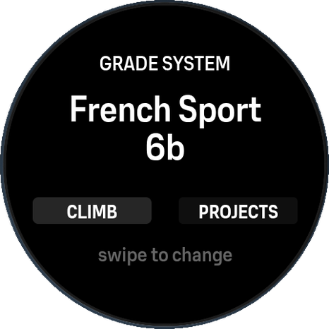
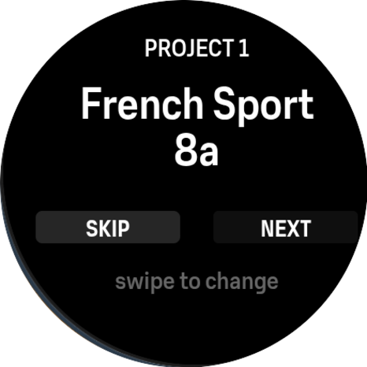
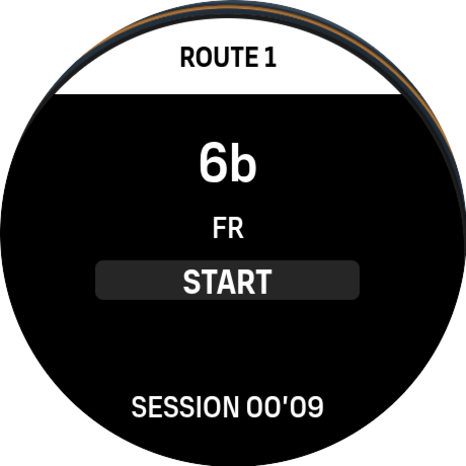
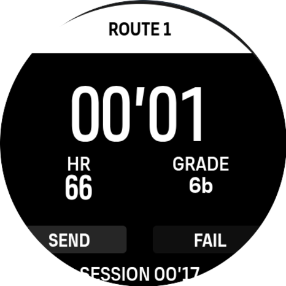
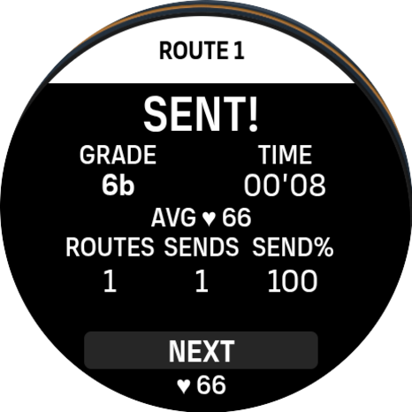

# Climb Log

Route logger for climbing sessions on Suunto watches. Tracks grades across 8 systems, logs sends and fails with time and heart rate, and supports project tracking for repeat attempts on specific routes.

## Screenshots

| Setup | Project Config | Ready | Climbing | Break |
|:---:|:---:|:---:|:---:|:---:|
|  |  |  |  |  |

## Screen Flow

```
SETUP → READY → CLIMBING → BREAK → READY → ...
```

### Setup

Configure your grade system and up to 5 project routes on the watch before climbing.

- **Swipe up/down** or **buttons up/down**: cycle through options
- **Tap CLIMB** (step 0): skip projects, go straight to ready
- **Tap PROJECTS** (step 0): configure project routes (steps 1-5)
- **Tap SKIP** (steps 1-5): skip remaining projects, go to ready
- **Tap NEXT/OK**: advance to next project / finish setup

Set a project grade to **OFF** to disable that project slot.

### Ready

Pick your grade and start climbing.

**Free mode** (default):
- **Swipe up/down** or **buttons up/down**: cycle grades
- **Tap START** or **long press down**: begin climbing

**Project mode**:
- **Swipe up/down** or **buttons up/down**: cycle through projects
- Shows attempts, sends, and best time for each project
- Grade is locked to the project grade

**Switching modes:**
- **Long press up**: toggle between free and project mode

**Hidden:**
- **Double-tap** the grade system label (FR/UIAA/...): cycle grade system

### Climbing

Timer runs. Log the result when done.

- **Tap SEND**: log a send
- **Tap FAIL**: log a fail
- **Long press up**: log a fail (physical button)
- **Long press down**: log a send (physical button)
- All actions trigger a silent lap marker in the workout

### Break

Review the result, correct the grade if needed, then continue.

- **Swipe up/down** or **buttons up/down**: correct the grade of the route just logged
- **Tap NEXT** or **long press down**: return to ready screen

## Grade Systems

| # | System | Example Grades | Typical Use |
|---|--------|----------------|-------------|
| 0 | French | 3a ... 9c | Sport climbing (Europe) |
| 1 | UIAA | 4 ... 12- | Sport/trad (Central Europe) |
| 2 | YDS | 5.5 ... 5.15d | Sport/trad (North America) |
| 3 | British | 4a ... 7b | Trad climbing (UK) |
| 4 | Ice (WI) | WI2 ... WI7+ | Ice climbing |
| 5 | Mixed | M1 ... M12 | Mixed climbing |
| 6 | V-Scale | VB ... V12 | Bouldering (North America) |
| 7 | Fontainebleau | 4A ... 8C+ | Bouldering (Europe) |

## Companion App Dashboard

The Suunto mobile app shows read-only stats for the current state of the app:

- **Grade System** — which system is active (e.g. "French", "UIAA")
- **Project 1-5** — active project grades (e.g. "6b+", "OFF")
- **Total Routes / Sends / Send Rate** — cumulative across all sessions
- **Sessions** — number of exercises started

All configuration is done on the watch via the setup screen. The companion app is a dashboard only.

## Project Tracking

Each grade system has 5 independent project slots. Projects are configured during setup on the watch and persist across sessions.

In project mode, the app tracks per-project:
- **Attempts** (sends + fails)
- **Sends**
- **Best time** (fastest send)

Project stats persist across sessions. Route logs reset each new activity.

## Controls Reference

### Touch

| Screen | Gesture | Action |
|--------|---------|--------|
| Setup | Swipe up/down | Cycle system or grade |
| Setup | Tap CLIMB (step 0) | Skip to ready |
| Setup | Tap PROJECTS (step 0) | Configure projects |
| Setup | Tap SKIP (steps 1-5) | Skip to ready |
| Setup | Tap NEXT/OK (steps 1-5) | Advance / finish |
| Ready | Swipe up/down | Cycle grade (free) or project (proj) |
| Ready | Tap START | Begin climbing |
| Ready | Tap title bar | Toggle free/project mode |
| Ready | Double-tap system label | Cycle grade system |
| Climbing | Tap SEND | Log send + lap |
| Climbing | Tap FAIL | Log fail + lap |
| Break | Swipe up/down | Correct grade |
| Break | Tap NEXT | Back to ready |

### Physical Buttons

All buttons are locked (`type="lock" longType="lock"`) to prevent native watch actions.

| Screen | Button | Action |
|--------|--------|--------|
| Setup | Up | Cycle up |
| Setup | Up long | PROJECTS / NEXT / OK |
| Setup | Down | Cycle down |
| Setup | Down long | CLIMB / SKIP |
| Ready | Up | Cycle grade/project up |
| Ready | Up long | Toggle free/project mode |
| Ready | Down | Cycle grade/project down |
| Ready | Down long | Start climbing |
| Climbing | Up long | Fail + lap |
| Climbing | Down long | Send + lap |
| Break | Up | Grade up |
| Break | Down | Grade down |
| Break | Down long | Next (back to ready) |

## Data Logging

`totalRoutes` is logged as a time-series graph visible in the Suunto mobile app after the workout. Shows a staircase curve that can be compared against heart rate.

## Session Summary

After ending the exercise, the watch and Suunto app show:
- **Sends / Routes**: e.g. "3 / 10"
- **Highest Send**: e.g. "2* M6" (2 sends at grade M6)

Grade names are loaded from flash (`evalFile`) during the session to stay within memory limits. See [#10](https://github.com/wylandplex/suuntoplus-climb-logger/issues/10).

## Memory Optimization

Grade strings (~200 objects) are not kept in JavaScript memory. Only grade counts (`GRADE_LENS`) are stored. Full grade arrays are available in `ext0.js`-`ext7.js` (loaded from flash on demand via `evalFile`). HTML templates maintain their own copy for display.

## Data Storage

Routes are saved to `localStorage` during a session but cleared on each new activity start:

```json
[
  {"grade": 18, "sys": 0, "duration": 83, "send": 1, "hr": 145, "proj": 0},
  {"grade": 18, "sys": 0, "duration": 120, "send": 0, "hr": 152, "proj": 2}
]
```

Project stats (`climbProjStats`) and watch setup (grade system + project grades) persist across sessions.

## Compatibility

Starting with v2.82, the app restricts itself to UI2 watches via the `displays: ["n", "o", "q"]` tag on all templates. Supported models: Vertical, Vertical 2, Race, Race S, Race 2, Ocean, Ocean Lite, 9 Peak Pro. Older UI1 models (e.g. Vertical Solar) are excluded because the app couldn't run reliably on them.

Developed and tested on **Suunto Vertical 2**. If your supported watch encounters problems, please [open an issue](https://github.com/wylandplex/suuntoplus-climb-logger/issues) with your watch model and firmware version.

## Development

Requires [SuuntoPlus Editor](https://marketplace.visualstudio.com/items?itemName=Suunto.suuntoplus-editor) for VS Code.

```bash
# Open in VS Code
code climb-logger/

# Test: Command Palette → "SuuntoPlus: Open SuuntoPlus Simulator"
# Deploy: Command Palette → "SuuntoPlus: Deploy to Watch"
```

## Version History

- **v2.82** — Restrict to UI2 watches via `displays: ["n", "o", "q"]` on all templates (excludes UI1 models that couldn't run reliably)
- **v2.81** — Fix memory crash on companion app settings sync
- **v2.8** — Companion app becomes stats dashboard (remove project settings, add read-only variables for projects + cumulative stats)
- **v2.7** — Fix companion app project settings sync, compatibility note for older watch models
- **v2.6** — Session summary (sends/routes + highest send grade), Suunto icon font for labels, sp-vertical-center layouts, UI polish across all screens
- **v2.4** — Button lock (prevents native actions), long press for send/fail, break screen grade buttons, memory optimization (GRADES to evalFile), route reset per session, phone settings with real grades per system, totalRoutes graph logging, removed ignoreEvent throttle
- **v2.3** — Fix layout for all display sizes, memory optimization, removed phone settings
- **v2.2** — Refactored main.js, fixed watch font rendering (f-num to sp-t for text)
- **v2.1** — Real climbing grade systems (8 systems), flick gestures
- **v2.0** — Redesigned UI, simpler lap flow, project routes
- **v1.0** — Initial release
