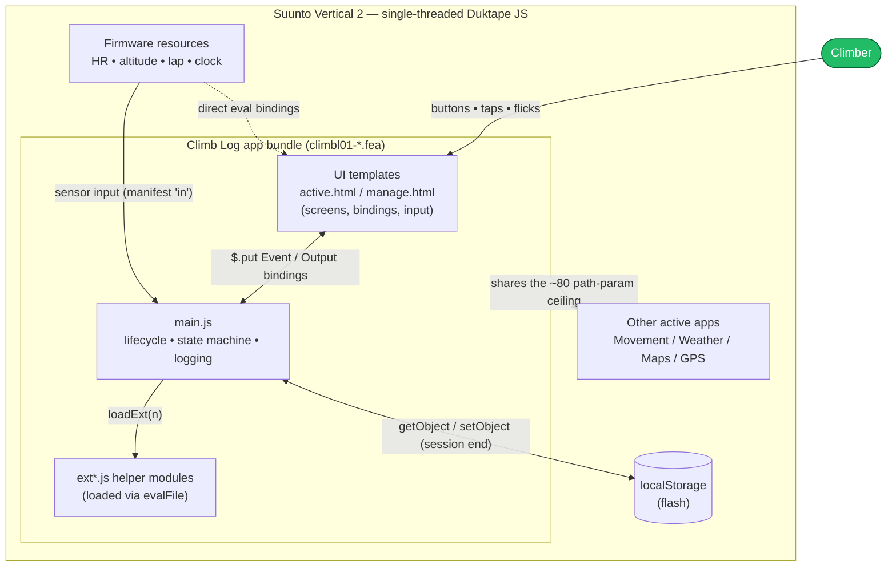
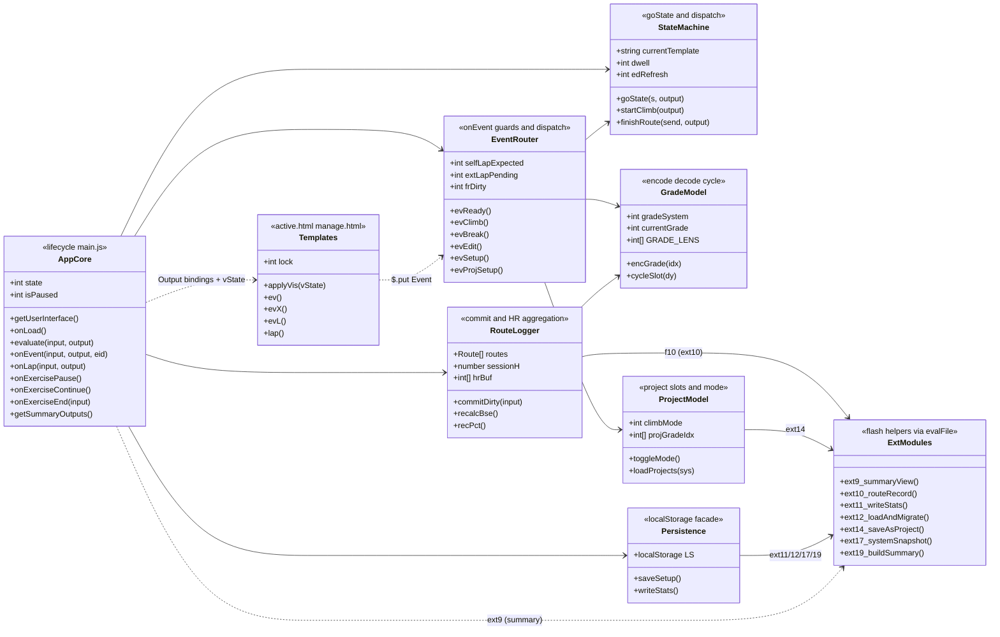
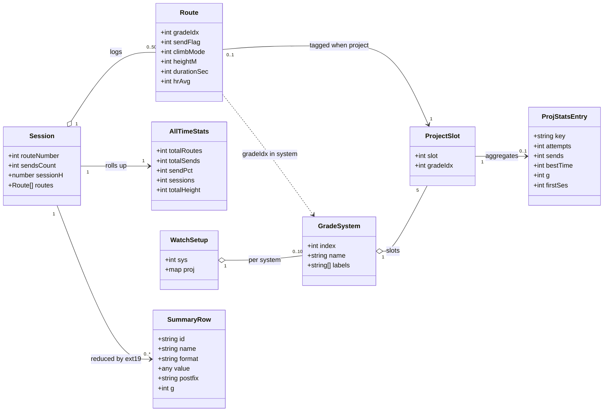
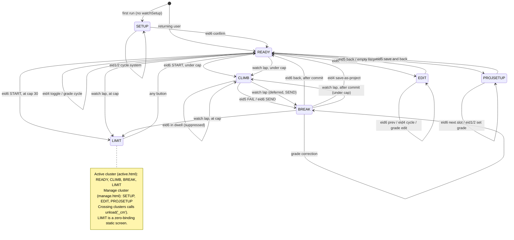
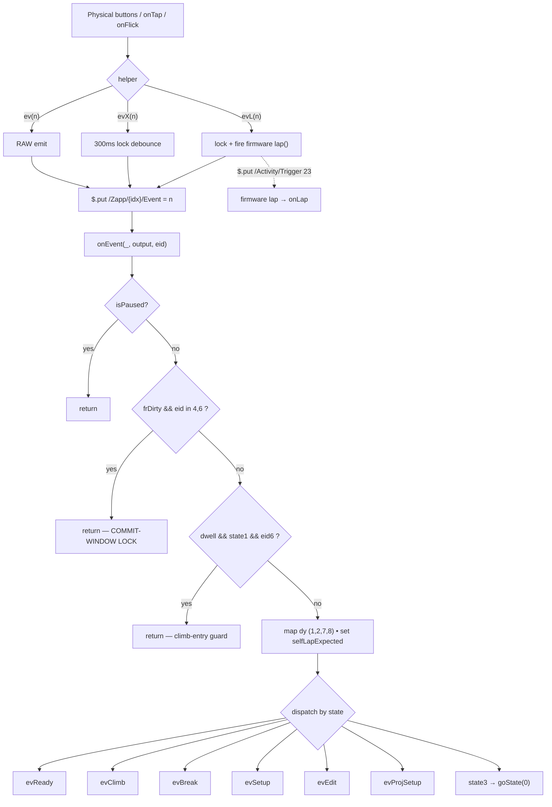
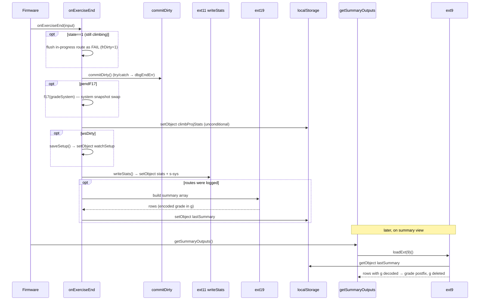
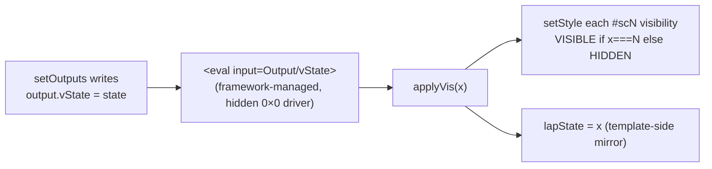

# Climb Log — Architecture

> **Scope.** Full architectural reference for the Climb Log SuuntoPlus app (Suunto Vertical 2): user stories, a logical class/component model, the state machine, runtime control flow, the data & persistence model, the UI/binding architecture, the resource/quality constraints, and the manifest/IO contract.
>
> **Method.** Derived directly from source (`main.js`, `active.html`, `manage.html`, `ext*.js`, `manifest.json`, `data*.json`) and the ADRs/archive notes. Diagrams are [Mermaid](https://mermaid.js.org/) and render inline on GitHub. Claims are anchored to `file:line`.
>
> **A note on "classes".** This is a SuuntoPlus watch app: plain ES5 running on a single‑threaded [Duktape](https://duktape.org) engine, with module‑level state and functions — *not* OOP. Where this document shows "classes," they are **logical components** (cohesive groups of state + functions) and **data records**, modelled as UML classes for clarity. No `class` keyword exists in the code.

---

## Table of contents

1. [System context](#1-system-context)
2. [User stories](#2-user-stories)
3. [Logical component model](#3-logical-component-model)
4. [Domain & data model](#4-domain--data-model)
5. [State machine](#5-state-machine)
6. [Event & input model](#6-event--input-model)
7. [Runtime control flow (sequences)](#7-runtime-control-flow-sequences)
8. [UI / template architecture](#8-ui--template-architecture)
9. [Persistence model](#9-persistence-model)
10. [Extension modules (`ext*.js`)](#10-extension-modules-extjs)
11. [Resource & quality architecture](#11-resource--quality-architecture)
12. [Manifest & IO contract](#12-manifest--io-contract)
13. [Glossary](#13-glossary)
14. [Implementation status & known drift](#14-implementation-status--known-drift)

---

## 1. System context

Climb Log runs **inside an active workout** on the watch. The climber drives it with three physical buttons (and touch/flick equivalents); it reads firmware sensor resources, keeps everything in RAM during the session, and writes to `localStorage` (flash) **only at session end**. It coexists with other SuuntoPlus apps and firmware services that share a hard, watch‑wide binding budget.



**Key context facts**

- **One thread.** `evaluate()` runs at ~1 Hz; `onEvent`, `onLap`, etc. are dispatched between ticks and run to completion. Nothing preempts anything (`main.js` reads/writes shared globals with no locking — see [§6](#6-event--input-model)).
- **Shared budget, not per‑app.** `<eval>` bindings are persistent Watch‑Bridge (WB) subscriptions; the ceiling (~80 simultaneous path‑param paths) is shared across *all* active apps. This single fact drives most of the architecture ([§11](#11-resource--quality-architecture)).
- **Defer‑to‑end persistence.** Mid‑session flash writes cause ~0.5 s GC freezes, so every write is batched into `onExerciseEnd` ([§9](#9-persistence-model)).

---

## 2. User stories

**Personas**

- **Clara — the climber (in‑session).** Mid‑workout, gloves on, glancing at the wrist between attempts. Needs one‑button logging, zero latency, no crashes over a long session.
- **Pat — the planner (pre/post‑session, in the phone app).** Configures grade system and project targets, reviews stats afterward.

| # | As… | I want to… | so that… | Realised by |
|---|-----|-----------|----------|-------------|
| US‑1 | Clara | mark each route a **send** or **fail** with a single long‑press | I log attempts without breaking climbing flow | `CLIMB` state, `evClimb`→`finishRoute` (`main.js:329`) |
| US‑2 | Clara | have **grade switching stay instant** at all times | the watch never feels laggy when I dial a grade | grade events (eid 1/2/7/8) are never gated by any lock (`main.js:540‑542`) |
| US‑3 | Clara | **correct the grade** of the route I just finished | a misread grade doesn't pollute my stats | `BREAK` grade edit (`evBreak`, `main.js:339‑352`) |
| US‑4 | Clara | see **per‑route HR peaks** (1‑min / 3‑min) and **ascent height** | I get training load the firmware doesn't expose | HR ring buffer (`evaluate`, `main.js:491‑503`), `routeHeight` |
| US‑5 | Clara | work a **project** across sessions and watch attempts/sends/best‑time accumulate | I can track progress on a hard line | project mode (`climbMode>0`), `projStats`, `ext10` |
| US‑6 | Clara | start the **next climb directly from the break screen** | I keep moving between burns | a watch lap in BREAK does `BREAK`→`CLIMB` (`startClimb`, skips READY) once the prior route commits (`onLap`, `!frDirty`). |
| US‑7 | Clara | **edit or delete** a mis‑logged route (toggle send/fail, remove) | my history and stats stay honest | `EDIT` state, `evEdit` (`main.js:391‑473`) |
| US‑8 | Clara | get a **post‑workout summary** (sends/routes, hardest send, time, HR, height) | I review the session at a glance | `getSummaryOutputs`→`ext9`, built by `ext19` |
| US‑9 | Clara | the app **must not crash on a long multi‑app session** | I trust it for a full day out | route‑limit valve (`LIMIT` state, `ROUTE_LIMIT=30`), binding split |
| US‑10 | Pat | choose my **grade system** (French, YDS, V‑scale, …) | grades read in the scale I use | `SETUP` state, `gradeSystem`, settings `stats.system` |
| US‑11 | Pat | pre‑configure **up to 5 project slots** per system | my projects are ready before I climb | `PROJSETUP` state, `projGradeIdx`, settings `pX_Y` |
| US‑12 | Clara | **promote a just‑climbed route into a new project** on the fly | I can start tracking a line I just discovered | save‑as‑project (`ext14`, `main.js:240`) |

**Traceability** — each story maps to a state and/or component; see [§5](#5-state-machine) and [§3](#3-logical-component-model).

---

## 3. Logical component model

The code is one `main.js` plus seven flash‑loaded `ext*.js` helpers and two HTML templates. Grouped by responsibility:



**Boundaries & contracts**

- **`AppCore` ↔ `Templates`** communicate *only* through framework data: the app publishes named **outputs** (`setOutputs`, `main.js:125‑157`) and the template raises **events** by writing an int to `/Zapp/{zapp_index}/Event` (`active.html:17`). There are no direct calls across the boundary.
- **`StateMachine.goState`** is the single state mutator: it sets `state`, resolves the template cluster, unloads on a cluster switch, and publishes outputs (`main.js:193‑208`).
- **`ExtModules`** are pure‑ish functions returned by `evalFile`; several **mutate shared objects in place** (`projStats`, `routes`, `projGradeIdx`) and return only scalars — a deliberate reference‑mutation contract ([§10](#10-extension-modules-extjs)).

---

## 4. Domain & data model

### 4.1 Domain entities



### 4.2 Route record (the hot data structure)

A route is a **6‑element array** built by `ext10.js:13` and pushed in `commitDirty` (`main.js:273`):

| Idx | Field | Type | Notes |
|----|-------|------|-------|
| `[0]` | grade index | int | editable in `BREAK`/`EDIT` **only if free** (`rr[2]===0`) |
| `[1]` | send flag | 0/1 | toggled in `EDIT`; counts toward `totalSends` |
| `[2]` | climbMode | int | 0 = free, 1..5 = project slot; **grade‑locks** the record when >0 |
| `[3]` | height (m) | number | `round(curAsc-startAsc)`, ≥0; summed into `sessionH` |
| `[4]` | duration (s) | number | feeds project `bestTime` and summary climb‑time |
| `[5]` | HR avg | number | averaged across routes in the summary |

`routes[]` carries a defensive last‑50 splice (`main.js:274`), but it is effectively dead code at the current cap: the `ROUTE_LIMIT = 30` new‑climb valve (`main.js:290`, [§11](#11-resource--quality-architecture)) blocks the 31st climb, so `routes.length` tops out at ~30 and the `>50` splice never fires. The 50 is a backstop that would only engage if `ROUTE_LIMIT` were raised above 50.

### 4.3 Grade encoding

Grades cross the JS↔template boundary as one packed int so the HTML can decode without app state (`encGrade`, `main.js:73`):

```
encoded = gradeSystem * 100 + gradeIndex
```

Decoded by `dG(x)` (`active.html:7`):

- `x < 0` → `--` (no value: no last grade / no best send)
- `x % 100 >= 50` → `OFF` (empty project slot; `encGrade(50)` sentinel)
- else system `= floor(x/100)`, index `= x % 100` → label from `G[system][index]`

Two distinct "empty" concepts share one decoder: stored empty slot is `-1` but is mapped to `encGrade(50)→OFF` at display time, while `--` (`<0`) means "nothing yet."

### 4.4 The 10 grade systems

`GRADE_LENS = [41,24,29,11,14,30,11,12,1,1]` (`main.js:49`), `DEFAULT_IDX = [18,6,5,5,4,12,3,5,0,0]` (`main.js:51`).

| idx | System | #grades | Default |
|-----|--------|--------:|---------|
| 0 | French Sport | 41 | 6a |
| 1 | UIAA Sport | 24 | 6 |
| 2 | YDS Sport | 29 | 5.10a |
| 3 | British Trad | 11 | 5c |
| 4 | V‑Scale | 14 | V3 |
| 5 | Font Boulder | 30 | 6A |
| 6 | Ice (WI) | 11 | WI4 |
| 7 | Mixed (M) | 12 | M6 |
| 8 | Hangboard | 1 | Set |
| 9 | Scrambling | 1 | Lap |

Systems 8/9 are degenerate single‑label "counters" (no project slots).

---

## 5. State machine

Seven states across two template **clusters**. `goState(s)` derives the cluster from the state number (`s < 4` → `active.html`, `s >= 4` → `manage.html`) and calls `unload('_cm')` only when crossing the boundary (`main.js:195‑198`).



### 5.1 State catalogue

| # | Name | Cluster | Purpose |
|---|------|---------|---------|
| 0 | **READY** | active | Home/idle. Start climb, toggle free/project, cycle grade or slot, open STATS/EDIT. |
| 1 | **CLIMB** | active | Route in progress. `evaluate()` accumulates HR + duration; live route height. Finish via FAIL/SEND. |
| 2 | **BREAK** | active | Post‑route review. Shows last grade/HR peaks/height + session tally. Allows grade fix, save‑as‑project, next climb. |
| 3 | **LIMIT** | active | Route‑limit safety valve (static text, **0 bindings**). Reached only at the cap; any button → READY; START re‑blocks until save+restart. |
| 4 | **SETUP** | manage | First‑run grade‑system picker. |
| 5 | **EDIT** | manage | Per‑route history editor (free‑mode STATS entry). |
| 6 | **PROJSETUP** | manage | Project‑slot grade configurator (5‑slot wizard). |

### 5.2 Transition table (exhaustive)

| From → To | Trigger | Guard | Key side effects |
|-----------|---------|-------|------------------|
| boot → 0/4 | `onLoad`/`getUserInterface` | `initReady()` = watchSetup exists & not `showSetupOnStart` | hydrate via `ext12`; `sessions++`; **no** `setOutputs` in onLoad |
| 0 → 1 | eid6 START | `routes<30` & (free or slot has grade) | reset HR accumulators, `startAsc=curAsc`, `dwell=1` |
| 0 → 3 | eid6 START | `routes>=30` | `goState(3)`; no climb |
| 0 → 1 | watch lap (native) | `state0 & !selfLapExpected` | `startClimb` (→ LIMIT/state 3 if at cap) |
| 0 → 5 | eid5 | `climbMode===0` | `editIdx=last`; cluster switch (unload) |
| 0 → 6 | eid5 | `climbMode>0` | `pStep=0`; cluster switch |
| 0 → 0 | eid4 / grade cycle | — | `toggleMode` or grade/slot cycle |
| 1 → 2 | eid5 FAIL / eid6 SEND | dwell suppresses eid6 only | `finishRoute`: `frDirty=1`, `routeNumber++`, `goState(2)` |
| 1 → 2 | watch lap (native) | `state1 & !selfLapExpected` | `extLapPending=1` → next `evaluate` tick `finishRoute(1)` (SEND); an in‑flight app FAIL/SEND clears it first; **suppressed in the `dwell` entry tick** (`!dwell` on the drain) |
| 1 → 1 | eid6 in dwell tick / watch lap in dwell tick | `dwell & state1` | **suppressed** (can't insta‑finish — eid6 at `onEvent:557`, lap drain at `evaluate:513`) |
| 1 → end | `onExerciseEnd` while climbing | `state1` | in‑progress route flushed as a FAIL — **or SEND if a watch lap (`extLapPending`) was pending** |
| 2 → 0 | eid6 back | `eid6 & !frDirty` (+commit lock) | `goState(0)` |
| 2 → 0 | eid4 save‑as‑project | `!frDirty` (commit lock) | `ext14`; `wsDirty=1`; `goState(0)` |
| 2 → 2 | grade correction | `dy != 0` | edits `routes[len-1][0]` once committed; **not** gated by lock |
| 2 → 1 | watch lap (native) | `state2 & !frDirty & !selfLapExpected` | `startClimb` — start the next climb, skipping READY (→ LIMIT/state 3 if at cap). A lap arriving *inside* the commit window (`frDirty`) is dropped, not deferred (nit). |
| 3 → 0 | any button | `state3` | `goState(0)`; START re‑blocks |
| 4 → 0 | eid6 confirm | — | `goState(0)`; `saveSetup` deferred |
| 4 → 4 | eid1/2 | `dy != 0` | cycle `gradeSystem`; `wsDirty`,`pendF17` |
| 5 → 0 | eid5 / empty list | — | commit pending DEL; cluster switch |
| 5 → 5 | eid6 prev / eid4 cycle / eid1‑2 grade | various | edit route history |
| 6 → 0 | eid5 | — | `goState(0)`; `saveSetup` deferred |
| 6 → 6 | eid6 next slot / eid1‑2 grade | — | advance `pStep`; set slot grade |

### 5.3 Initial‑state resolution

`initReady()` (`main.js:59‑62`) is the single source of truth, shared by `getUserInterface()` and `onLoad()`:

```
initReady() = watchSetup exists  AND NOT stats.showSetupOnStart
```

- **TRUE** (returning user) → `READY` (state 0, active cluster).
- **FALSE** (first run / forced setup) → `SETUP` (state 4, manage cluster).

Because both entry points derive from the *same* call, `currentTemplate` (set by `getUserInterface`) and `state` (set by `onLoad`) can never disagree, regardless of which the framework calls first.

---

## 6. Event & input model

### 6.1 Input → event → dispatch pipeline



### 6.2 Event‑ID catalogue

| eid | Meaning | Notable per‑state behaviour |
|----:|---------|-----------------------------|
| 1 | UP / grade +1 | free: grade +1 (mod len); project: `cycleSlot(+1)`; EDIT: route grade +1; SETUP: system +1; PROJSETUP: slot grade +1 |
| 2 | DOWN / grade −1 | mirror of eid 1 |
| 4 | MID action | READY: `toggleMode`; **BREAK: save‑as‑project** (lock‑gated); EDIT: cycle send‑state FAIL→DEL→SEND |
| 5 | UP‑long / STATS·FAIL·back | READY: open EDIT/PROJSETUP; **CLIMB: FAIL**; EDIT: back; PROJSETUP: save&back |
| 6 | DOWN‑long / START·SEND·next | READY: **START**; **CLIMB: SEND** (dwell‑gated); BREAK: back (lock‑gated); SETUP: confirm; EDIT: prev; PROJSETUP: next slot |
| 7 | flick‑up / +3 | grade jump ±3 in **states 0/2 (READY/BREAK)** only; inert in CLIMB (`evClimb` ignores `dy`) and elsewhere |
| 8 | flick‑down / −3 | mirror of eid 7 |

### 6.3 Guards (why presses are sometimes ignored)

| Guard | Where | Purpose |
|-------|-------|---------|
| `isPaused` | `onEvent:546`, `evaluate:492` | drop all input/aggregation while the exercise is paused |
| **commit‑window lock** | `onEvent:556` | while `frDirty` (route awaiting commit, ~1 tick in BREAK), ignore **eid 4/6** so you can't save‑as‑project without the pending route or bounce BREAK→READY pre‑commit. **eid 1/2/7/8 (grade/slot) deliberately pass through — switching stays fluid.** |
| `dwell` | `onEvent:557` | for one tick after entering CLIMB, suppress **eid 6** so the long‑press that started the climb can't instantly finish it as a SEND (eid 5 FAIL still passes) |
| `!dwell` on lap drain | `evaluate:513` | same one‑tick climb‑entry protection for the watch‑lap finish path — a lap in the entry window can't insta‑finish the just‑started climb (companion to the `dwell` eid 6 guard) |
| `selfLapExpected` | `onEvent:563` / `onLap:582` | the user's START/FAIL/SEND fires a firmware lap via `evL`; this flag makes `onLap` swallow that self‑lap instead of double‑triggering |
| `extLapPending` | set `onLap:585` / drain `evaluate:513` / cleared `finishRoute:217` + `onExerciseEnd` | a watch lap in CLIMB defers its SEND‑finish one tick so an in‑flight app FAIL/SEND wins; `onExerciseEnd` honors a pending SEND, the drain is `!dwell`‑gated |
| `!frDirty` (×2) | `evBreak:346/356` | belt‑and‑suspenders on individual BREAK actions during the commit window |
| flick state‑scope | `onEvent:560‑562` | eid 7/8 map `dy` only in states 0/1/2 and are acted on only in 0/2 (CLIMB's `evClimb` ignores `dy`) |
| template `lock` (300 ms) | `active.html:19‑21` | client‑side debounce on action pills |
| `ROUTE_LIMIT` | `startClimb:290` | refuse new climbs at 30 (any entry path, incl. watch lap → LIMIT at cap) |
| project‑slot‑set (#103) | `startClimb:293` | block START in project mode if the slot has no grade |

> **Concurrency note.** Because the engine is single‑threaded and run‑to‑completion, these are all *sequential* guards (a flag checked at the top of a callback) — not locks against preemption. A press can never interrupt a calculation; the only hazard is a *second queued event* arriving in the new state, which the commit‑window lock + `dwell` address.

### 6.4 `onLap` dual role

`onLap` both **suppresses app self‑laps** (consumes `selfLapExpected` — the firmware echo of a lap fired by `evL` when the user presses START/FAIL/SEND) and **handles genuine watch‑native laps** (the down/lap button or auto‑lap, which arrive with no accompanying app event):

- **READY → CLIMB:** a native lap starts the climb (`startClimb`).
- **CLIMB → finish:** a native lap finishes the route as a **SEND**, but *deferred* — `onLap` only sets `extLapPending`, and the next `evaluate` tick calls `finishRoute(1)`. It cannot finish inline: `onLap` fires around `onEvent` on this platform with no guaranteed order, and a direct finish would race the app's FAIL/SEND eid — the original "every‑route‑is‑a‑send" bug. Deferring is **order‑independent**: an app FAIL/SEND in the same gap calls `finishRoute` (which clears `extLapPending`) and wins; a lap with no event falls through to the SEND default. Three pre‑emptions of the drain are handled: (a) the `dwell` entry tick — the `!dwell` gate on the drain stops a lap from insta‑finishing a just‑started climb; (b) `onExerciseEnd` before the next tick — it honors a pending SEND (`frSend = extLapPending ? 1 : 0`); (c) `isPaused` before the next tick — the flag survives the pause and the SEND lands on the first tick after `onExerciseContinue` (deferral stretches across the pause, outcome unchanged).
- **BREAK → CLIMB:** a native lap starts the **next climb, skipping READY** (`startClimb`), gated by `!frDirty` so the just‑finished route commits first. This makes the watch lap a single "advance the phase" control: `READY→CLIMB→BREAK→CLIMB→…`. (The down‑long button, by contrast, takes BREAK→READY so STATS/EDIT stay reachable — it does **not** fire a lap in BREAK.)

---

## 7. Runtime control flow (sequences)

### 7.1 Log one route — the commit window

The transition is cheap and synchronous; the heavy work is deferred one tick to `commitDirty`. The gap between `finishRoute` (sets `frDirty`) and the next `evaluate` (clears it) is the **commit window** the lock protects.

```mermaid
sequenceDiagram
    actor User
    participant T as Template (active.html)
    participant FW as Firmware
    participant E as onEvent
    participant V as evClimb / finishRoute
    participant Ev as evaluate (1 Hz)
    participant C as commitDirty
    participant X as ext10 (f10)

    User->>T: long-press SEND (evL(6))
    T->>FW: $.put /Activity/Trigger 23 (lap)
    T->>E: $.put Event = 6
    Note over E: selfLapExpected = 1
    E->>V: finishRoute(send=1)
    V->>V: lastResult/Grade/Height set; sendsCount++
    V->>V: frDirty=1; routeNumber++; goState(2)
    Note over E,C: BREAK shown — route NOT yet in routes[]
    rect rgb(255,243,224)
    Note over E: COMMIT-WINDOW LOCK: eid 4/6 ignored<br/>grade (1/2/7/8) still live
    User-->>E: (accidental fast press 4/6) → dropped
    end
    FW-->>E: onLap → selfLapExpected consumed, returns
    Ev->>C: next tick: commitDirty(input)
    C->>X: f10(grade, hr, height, …)
    X-->>C: [bestSendIdx, _, routeTuple, key, projStats]
    C->>C: routes.push; totals++; sessionH+=h; frDirty=0
    Note over E: lock released — eid 4/6 act again
```

### 7.2 Save‑as‑project (BREAK → new project)

```mermaid
sequenceDiagram
    actor User
    participant E as onEvent / evBreak
    participant S as saveAsProject
    participant X as ext14
    User->>E: MID (evX(4)) on BREAK
    alt frDirty still set
        E-->>User: ignored (commit-window lock)
    else committed
        E->>S: saveAsProject(output)
        S->>X: ext14(climbMode, sys, lastGrade, …, routes, ses)
        alt free mode & an empty slot exists
            X->>X: assign slot; seed projStats; tag routes[last][2]=slot
            X-->>S: [grade, slot]
            S->>S: currentGrade/climbMode set; wsDirty=1; goState(0)
        else already a project or all slots full
            X-->>S: null (no-op)
        end
    end
    Note over S: NO localStorage write — wsDirty drains at session end
```

### 7.3 Session end & summary



### 7.4 Startup / initial‑state resolution

```mermaid
sequenceDiagram
    participant FW as Firmware
    participant GUI as getUserInterface
    participant L as onLoad
    participant E12 as ext12
    participant LS as localStorage

    FW->>GUI: getUserInterface()
    GUI->>GUI: initReady() → "active" | "manage"
    GUI-->>FW: {template: currentTemplate}
    FW->>L: onLoad()
    L->>L: f10=ext10, f11=ext11 (cache once)
    L->>E12: loadExt(12)(allTimeStats)
    E12->>LS: read stats / climbProjStats / watchSetup / s0..s9
    E12->>E12: one-time legacy migration (mig flag)
    E12-->>L: [gradeSystem, projGradeIdx, projStats, allProjects]
    L->>L: sessions++; currentGrade=DEFAULT_IDX[sys]
    L->>L: if initReady() state=0 else stays 4
    Note over L: NEVER setOutputs here ("max app" crash)
```

---

## 8. UI / template architecture

### 8.1 Two‑cluster split (ADR‑002)

`visibility:HIDDEN` does **not** unsubscribe `<eval>` bindings, so a monolithic template kept *all* bindings live regardless of which screen showed. The fix: split into two clusters so only one set is live at a time.

| Template | Cluster | States / screens | Live `<eval>` bindings |
|----------|---------|------------------|----------------------:|
| `active.html` | active | sc0 READY, sc1 CLIMB, sc2 BREAK, **sc3 LIMIT (0 bindings)** | **25** |
| `manage.html` | manage | sc4 SETUP, sc5 EDIT, sc6 PROJSETUP | **11** |

`goState` switches `currentTemplate` and calls `unload('_cm')` on a cluster boundary (`main.js:195‑198`). The frequent READY↔CLIMB↔BREAK cycle stays inside `active.html` with **no unload churn**.

### 8.2 Visibility dispatch (`vState` → `applyVis`)



`<eval>` is used instead of `$.subscribe` because an `onLoad`‑scoped subscribe **leaked on template unload** (issue #90); eval bindings are framework‑managed and don't leak. The CSS parser rejects `display:none`, so hiding uses `visibility:HIDDEN`. Critically, **`setText` on a hidden section is a silent no‑op** — which is why break counters and project‑stats lines were migrated from `setText` to output bindings, and why EDIT uses a post‑mount `edRefresh` countdown (`main.js:204‑207,513`).

### 8.3 Input surfaces

Three input channels all funnel into `ev/evX/evL` → `$.put Event`:

- **Physical buttons** (`<userInput>`, gated by `{{HAS_ON_EVENT}}`): up `ev(1)`/`evL(5)`, next `ev(4)`, down `ev(2)`/`evL(6)`.
- **Touch zones** (`onTap` over pills/chevrons), e.g. `evX(5)` to open EDIT.
- **Flicks** (`onFlickUp=ev(7)`, `onFlickDown=ev(8)`) for ±3 grade jumps.

`evL` additionally fires a firmware lap (`$.put /Activity/Trigger 23`) when starting from READY or finishing from CLIMB, so the firmware records the Lap/‑2 HR/duration the BREAK screen reads directly.

### 8.4 Output consumption

All **14** declared outputs are consumed by the templates (no orphans). `modeSub` and `routeHeight` are *context‑multiplexed*:

- `modeSub`: `ROUTE n` (free) / `PROJECT n` (project, negative) / `gradeSystem` (SETUP) / `routes.length` (EDIT) / `pStep+1` (PROJSETUP).
- `routeHeight`: **current‑route live height in CLIMB**, session total everywhere else (`main.js:130`).

---

## 9. Persistence model

### 9.1 Defer‑to‑end discipline

**No `localStorage` write happens mid‑session.** Every persistent write is concentrated in `onExerciseEnd` (`main.js:517‑533`). Mid‑session mutations only touch in‑memory state and set a **dirty marker** drained at the end. Rationale: mid‑session `setObject` triggers ~0.5 s flash‑GC freezes on a single thread.

```mermaid
flowchart LR
    subgraph During["During session (RAM only)"]
        M1["grade-system change → wsDirty, pendF17"]
        M2["project edit → wsDirty"]
        M3["route finished → frDirty"]
        M4["project route / edit → projStatsDirty"]
    end
    subgraph Flush["onExerciseEnd (single flush)"]
        F0["commitDirty (drain frDirty)"]
        F1["f17 snapshot swap (if pendF17)"]
        F2["setObject climbProjStats"]
        F3["saveSetup (if wsDirty)"]
        F4["writeStats → stats + s&lt;sys&gt;"]
        F5["lastSummary (if any routes)"]
    end
    During --> Flush
```



### 9.2 Dirty markers

| Marker | Set when | Drained when |
|--------|----------|--------------|
| `frDirty` | route finished (`finishRoute:221`) | `commitDirty:264` (every tick) + end; also the commit‑window lock |
| `wsDirty` | grade‑system / project‑slot / save‑as‑project edit | `saveSetup` at end (`:538`) |
| `pendF17` | grade‑system change (`evSetup:372`) | `f17(...)` at end (`:535`) |
| `projStatsDirty` | project route logged / edited | end (`:537`) — **gates nothing** (climbProjStats is written unconditionally); informational |
| `dwell` | enter CLIMB (`goState:201`) | end of next `evaluate` (`:522`) — input guard, not persistence |
| `selfLapExpected` | user action that self‑laps (`onEvent:563`) | consumed in `onLap:582` — not persistence |
| `extLapPending` | watch lap in CLIMB (`onLap:585`) | drained in `evaluate:513` (`!dwell`‑gated) / cleared in `finishRoute:217` / honored as SEND in `onExerciseEnd` — input deferral, not persistence |
| `edRefresh` | enter EDIT (`goState:209`) | decremented in `evaluate:521` — UI refresh, not persistence |

### 9.3 `localStorage` keys

| Key | Shape | Written | Read |
|-----|-------|---------|------|
| `watchSetup` | `{sys, proj:{<sys>:int[5]}}` | end, if `wsDirty` | `initReady`; `ext12` at load |
| `stats` | large flat object (totals, `pX_Y` grades, peak/best metrics, `showSetupOnStart`, `mig`) — seeded by `data*.json` | end via `ext11`; `ext12` migration | `initReady`; `ext12`; `ext11`/`ext17` |
| `climbProjStats` | `{"<sys>_<slot>":{attempts,sends,bestTime,g,firstSes}}` | end (unconditional) | `ext12` at load |
| `s0`..`s9` | per‑system snapshot of totals + peak/best | `ext11`/`ext17`/`ext12` | `ext12`/`ext17` |
| `lastSummary` | summary‑row array from `ext19` | end, if `routes>0` | `ext9` (summary view) |
| `dbgEndErr` | `{msg}` | only if `commitDirty` throws at end | (debug only) |

> **Dual source of truth.** `watchSetup.proj` (app fast path) and `stats.pX_Y` (phone‑editable settings) both describe project slots; `ext12` reconciles them at load with `stats.pX_Y` winning where present.

---

## 10. Extension modules (`ext*.js`)

All load through one indirection: `loadExt(n) = evalFile('{file_path}/ext'+n+'.js')` (`main.js:54`). Each file is a bare `function(...){...}` expression, so `loadExt(n)` returns a callable invoked as `loadExt(n)(args)`. The `{file_path}` placeholder is resolved by the host at load time (the `ext*.js` ship *unminified* alongside `main.js` in the `.fea`; they are **not** inlined).

| Module | Role | Loaded | Cached? |
|--------|------|--------|---------|
| `ext10` | **Route‑commit engine** — build the 6‑tuple, update `bestSendIdx` + per‑project stats. Hot path. | `onLoad` → `f10` | ✅ (re‑parse fragmented the heap) |
| `ext11` | **writeStats** — merge `allTimeStats`+active project into `stats`, write `stats` + `s<sys>`, prune stale slots. | `onLoad` → `f11` | ✅ |
| `ext12` | **Startup loader/migrator** — rebuild in‑memory state from LS; one‑time legacy migration. | `onLoad` (once) | ❌ (one‑shot) |
| `ext14` | **save‑as‑project** — assign current free route to first empty slot. | per action | ❌ (rare) |
| `ext17` | **Grade‑system snapshot swap** — persist outgoing system's stats, restore incoming. | lazy on 1st system change → `f17` | ✅ lazy; runs at end |
| `ext19` | **Build summary array** from `routes[]` (sends/routes, hardest, time, HR, height). | end (once) | ❌ (output cached as `lastSummary`) |
| `ext9` | **Summary‑view formatter** — read `lastSummary`, decode `g`→grade label, strip `g`. | per summary view | ❌ |

**Caching rationale.** `f10`/`f11` are parsed once because `f10` runs on every route commit; lazy `f17` trims the `onLoad` `evalFile` burst (a "max app" contributor) and only ever parses if the user changes systems. Infrequent modules (`ext9/12/14/19`) re‑parse per use rather than hold a parsed function resident under the heap ceiling.

**Cross‑module contracts.** `ext19` *produces* the summary (encodes grade as field `g`); `onExerciseEnd` caches it to `lastSummary`; `ext9` *consumes* and decodes it — a producer/cache/consumer split precisely because LS in the summary‑view window is unreliable. `ext11`/`ext14` mutate shared objects (`projStats`, `projGradeIdx`) **in place** and return only scalars. `ext10` is the exception: it mutates `projStats` in place but does **not** touch `routes[]` — it *returns* a structured result `[bestSendIdx, 0, routeTuple, projKey, projStatsObj]` that the caller (`commitDirty`, `main.js:269‑279`) destructures, doing the `routes.push(routeTuple)` and the last‑50 splice itself.

---

## 11. Resource & quality architecture

This section is the *why* behind most design choices.

### 11.1 Quality attributes (hard constraints)

1. **Shared WB path‑param ceiling (~80).** `<eval>` bindings are persistent WB subscriptions; `visibility:HIDDEN` does not release them. The ceiling is **shared across all active apps** + GPS/Maps/firmware — not per‑app. Forensics caught overflow at exactly **81** simultaneous paths.
2. **JS heap ~133,120 B** on Duktape. Fixed cost alone is ~91% *before any route data*; ~120 B added per logged route. (zappsim's absolute % is pessimistic — trust the *shape*, not the number.)
3. **Single‑threaded, run‑to‑completion.** `evaluate()` is the only HR aggregator (1 Hz); sub‑1 s actions skip ticks (fast‑click race). Synchronous flash I/O blocks the same thread.
4. **Multi‑app coexistence** is a first‑class requirement; the residual hard crash fires when *another* app subscribes its outputs over the shared limit.

### 11.2 Crash modes (observed)

| Signature | Cause | Status |
|-----------|-------|--------|
| `ERR WBMAIN: Too many sim. path-param calls … res:2129` | cross‑app path overflow past ~80 | **mitigated, not fully fixable app‑side** (BACKLOG #121) |
| Heap‑exhaustion freeze on a transition at ~40 routes (single app) | heap budget tipped by accumulated routes + transient allocs | diagnosed‑open |
| "No Summary" (1‑2 fields) | `ext19` dropped zero‑valued fields (fast‑click routes) | fixed (emit all 6) |
| Fast‑click `--` HR on BREAK | sub‑1 s route ran `evaluate` 0–1×; firmware Lap/‑2 stale | known |
| `ERR APPLICATION: Zapp out unk g` | `ext9` left intermediate `g` field on a tile | fixed (`delete a[i].g`) |
| "max app" at start | minified size / RAM‑at‑init, **not** source size | mitigated: never `setOutputs` in `onLoad` |

### 11.3 Mitigations (the architecture's load‑bearing decisions)

- **2‑cluster template split** (ADR‑002): live bindings ~43 → ~25 during a workout.
- **Route‑limit valve** (`LIMIT`, `ROUTE_LIMIT=30`): forces save+restart, which resets per‑session heap/subscriptions. The screen is **zero‑binding** by design.
- **Defer‑to‑end persistence**: no mid‑session flash writes ([§9](#9-persistence-model)).
- **`<eval>` for `vState`** instead of leaky `$.subscribe` (issue #90).
- **Commit‑window action‑lock** (new): blocks eid 4/6 during the `frDirty` tick; grade events stay live.
- **`dwell` climb‑entry guard** + **`selfLapExpected`** ordering fix.
- **ext‑function caching (T7)** + lazy `f17`; **never write outputs in `onLoad`**.
- **Hidden‑section `setText` → output bindings**; output count trimmed 15 → 14; `routes[]` carries a defensive last‑50 splice (never reached at `ROUTE_LIMIT = 30`).

### 11.4 Budgets (current, verified)

| Budget | Value |
|--------|-------|
| `active.html` live bindings | **25** (sc3 LIMIT adds 0) |
| `manage.html` live bindings | **11** (ADR‑002 quoted 9 — drift) |
| Manifest outputs | **14** (was 15; dropped `climbing`) |
| Manifest inputs | **5** (H, A, M, D, Asc) |
| Settings | **49** (1 system + 40 `pX_Y` + 8 names) |
| Per‑route heap | ~120 B |
| JS heap ceiling | 133,120 B (~91% fixed) |

### 11.5 ADRs

- **ADR‑001 — Split Setup Screen** (Accepted). Separates *System Setup* (state 4, rarely changed, high‑friction guard) from *Project Setup* (state 6, changed every session, low‑friction). Origin of states 4 & 6 and the "one‑workout‑one‑system" invariant. Puts cost in cheap Flash (`ext17`/`ext18`) to spare scarce `main.js` parser budget.
- **ADR‑002 — Binding Architecture** (Accepted, shipped v3.0). The monolithic `cm.html` held ~46 always‑live bindings; split into `active.html`/`manage.html`. This *is* the cluster boundary and the binding budget the whole resource design revolves around. The `−`/`?`/freeze symptoms resolved; the residual cross‑app crash is the route‑limit's remit.

---

## 12. Manifest & IO contract

### 12.1 Metadata

`name="Climb Log"`, `version="3.0"`, `description="Track your progress on rock & ice."` (≤100 chars — the build validator rejects long ones), `type="feature"`, `usage="workout"`, `modificationTime` = Unix epoch int. Templates use `{name, displays}` with **no `path`** (files live in app root).

### 12.2 Inputs (`in`) — 5 sensor subscriptions

| Name | Source | Use |
|------|--------|-----|
| `H` | `Activity/Move/-1/Heartrate/Current` | per‑tick HR sample |
| `A` | `Activity/Lap/-2/HeartRate/Avg` | fallback avg HR |
| `M` | `Activity/Lap/-2/HeartRate/Max` | fallback max HR |
| `D` | `Activity/Lap/-2/Duration/Current` | fallback duration |
| `Asc` | `Fusion/Altitude/Ascent` | cumulative ascent → route height |

### 12.3 Outputs (`out`) — 14 variables

`grade`, `lastGrade`, `bestSend` (encoded grades) · `routePk1`, `routePk3` (**`log:true`** → written to the FIT record) · `climbMode`, `modeSub`, `routeHeight` · `vState` (drives `applyVis`) · `brkSends`, `brkRoutes` (BREAK tally) · `actT`, `actS`, `actB` (active‑project line; `-1` hides).

### 12.4 Watch API surface actually used

- **`$.put`** only: raise events (`/Zapp/{idx}/Event`) and fire a firmware lap (`/Activity/Trigger 23`). **No live `$.subscribe`** (removed for `vState`; comment‑only). No `$.get`.
- **Data binding** via `<eval input=… outputFormat=…>` to app outputs *and* directly to firmware paths (Lap/Move HR & duration, `/Dev/Time/LocalTime`).
- **Native template fns:** `setText`, `setStyle`, `unload('_cm')`, `setTimeout`. **`navigate()` and `playIndication()` are not used** — cluster switching is the JS‑side `goState` swap.
- **Lifecycle hooks implemented:** `getUserInterface`, `onLoad`, `evaluate`, `onEvent`, `onLap`, `onExercisePause/Continue`, `onExerciseEnd`, `getSummaryOutputs`. (`onExerciseStart`, `onAutoLap`, `onInterval`, `onAccelerometer` are **not** implemented.)

### 12.5 Build & deploy

- Build emits one `climbl01-<display>.fea` per display variant (l/m/n/o/q/s); `climb-logger.zip` bundles all six. A `.fea` is a ZIP containing minified `main.js`, unminified `ext*.js`, compiled `active.xml`/`manage.xml`, `manifest.jsn`, `data.jsn`.
- **Build = VS Code only** (SuuntoPlus Editor → "Build App"). Edit *source* only; **never hand‑patch the `.fea`**.
- Validation: `package.json` scripts run the external `zappsim` simulator (`validate`, `test:session-end`, `test:cycle-edit`, `test:rapid-stress`, `test:template-cycle`).

---

## 13. Glossary

| Term | Meaning |
|------|---------|
| **Route** | one START→FAIL/SEND cycle; a 6‑tuple in `routes[]` |
| **Send / Fail** | successful vs unsuccessful attempt (eid 6 vs eid 5 in CLIMB) |
| **Grade / system** | difficulty index within one of 10 rating scales |
| **Project / slot** | a tracked target line; up to 5 slots per system (`climbMode` 1..5) |
| **Free mode** | `climbMode===0`, ad‑hoc grade logging |
| **Session** | one workout, `onLoad`→`onExerciseEnd` |
| **Commit window** | the ~1‑tick gap where `frDirty=1` and the finished route isn't in `routes[]` yet |
| **Cluster** | a template (`active.html` / `manage.html`) hosting a group of states |
| **`OFF` / `--`** | empty project slot (`encGrade(50)`) / no value yet (`<0`) |
| **Route limit** | `ROUTE_LIMIT=30` in‑session cap → LIMIT screen → save+restart |
| **Defer‑to‑end** | all `localStorage` writes batched into `onExerciseEnd` |

---

## 14. Implementation status & known drift

Source is ground truth; some docs/memory predate recent edits. Confirmed drift at authoring time:

- **`ROUTE_LIMIT = 30`** in source (`main.js:52`); README/APPSTORE/BACKLOG/CHANGELOG prose now match. The committed `.fea` still bakes **35** (`W=35`) and the `fea-rebuild` memory still says 35 — a **VS Code "Build App" rebuild + zip repack is required** before the next deploy for the cap, the commit‑window lock (`main.js:556`), the project‑slot snapshot fix (`lastClimbMode`, `main.js:218`/`270`), AND the watch‑lap phase‑advance + `extLapPending` deferral (`onLap`/`evaluate`) to take effect on‑watch.
- **`manage.html` has 11 bindings**, not the 9 quoted in ADR‑002 (likely sc5/EDIT additions).
- **`sc3` LIMIT screen** post‑dates ADR‑002 and is deliberately binding‑free.
- **Output reduction shipped as 15 → 14** (dropped `climbing`), not ADR‑002 Variant C's floated "16 → 12."
- **Residual hard crash** (cross‑app ~80‑path ceiling, BACKLOG #121) is *mitigated* (split + route limit + restart‑between‑sessions), not fully fixable app‑side. BACKLOG #129 targets the BREAK screen's bindings next.
- Cosmetic residue: `data.json` still carries dead `avgHrr`/`activeHrr` keys (dropped from `main.js` in `f93ab98`).

> Several persisted `stats` fields (e.g. `peakGrade`, `pyramid`, `bestSessionHm`, `longestProject*`) are only *passed through* by `ext11`/`ext12`/`ext17` — no inspected module computes them, suggesting a companion analyzer app or a not‑loaded `ext` is the writer (the workspace is multi‑app).

---

*Generated from source analysis. When code and this document disagree, the code wins — update this file (and note the change in [§14](#14-implementation-status--known-drift)).*
